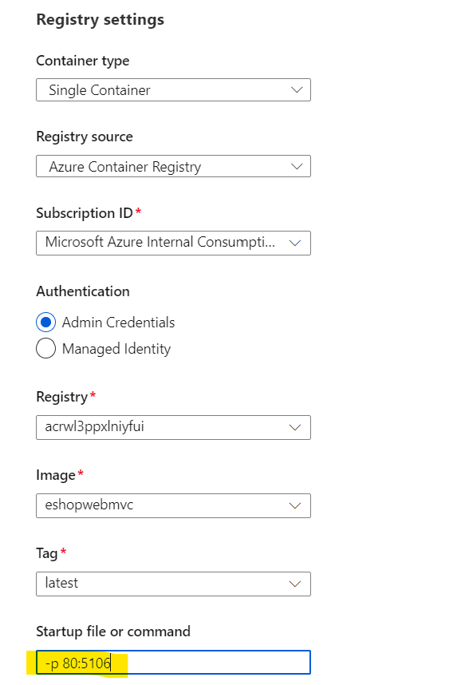

# App modified
For architecture simplicity (and problems related to deploy SQL on free subscriptions), inmemory database option is selected.


By default, the project uses a real database. If you want an in memory database, /src/Infrastructure/Dependencies.cs line 13:

```
var useOnlyInMemoryDatabase = true;
```

# ADO Pipelines
Located under the folder ".ado", you can find the following YAML pipelines:

- **main-ci.yml** : Dotnet  CI pipeline. Build + Test + Publish. Upload artifacts for website and webapp bicep file.
- **main-ci-containers-compose.yml** : It first creates an ACR and build/push docker containers based on docker compose. WARNING: you need to have an existing RG.
- **main-cd-web-aci.yml** : deploys container image on ACI using Bicep template. WARNING: you need to provide ACR username and password (using variable group / key vault).Contributor role is for management plane operations to manage key vaults. It does not allow access to keys, secrets and certificates. **READ/LIST access needed for used Service Principal in ADO VG**. TODO: using managed identity. 
- **main-cd-web-webapp.yml** : triggered by **main-ci.yml** and deploys app artifacts created by **main-ci.yml** to Azure Web App (linux). It uses bicep to create App Service Plan and WebApp, and publishes code to the webapp.

# Deployment options

## Azure App Service
Deployment of the Web solution works with the following settings:

